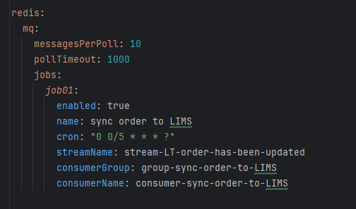
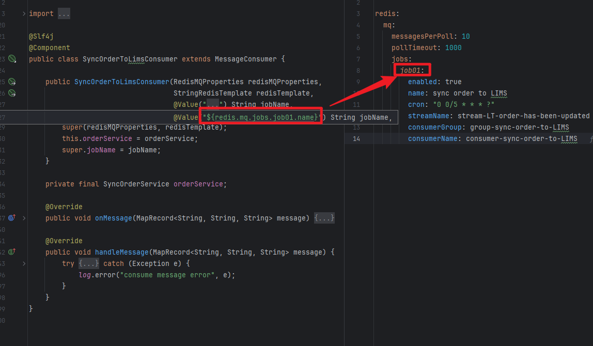
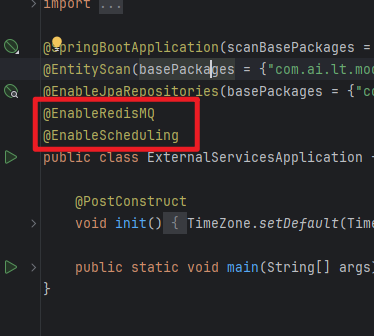

# redis-MQ-spring-boot-starter
message queue base on redis streams

# how to use
 - add dependency

        <dependency>
            <groupId>com.qima</groupId>
            <artifactId>redis-MQ-spring-boot-starter</artifactId>
            <version>1.0.0-release</version>
        </dependency>
 - add properties

    
 - add your own consumer. Implement handelMessage method(mandatory) and override onMessage method(optional)
    
 
 - enable redisMQ in your spring boot application by adding @EnableRedisMQ annotation;
 - enable scheduling in your spring boot application by adding @EnableScheduling annotation so that the consumer can retry on failed messages
    